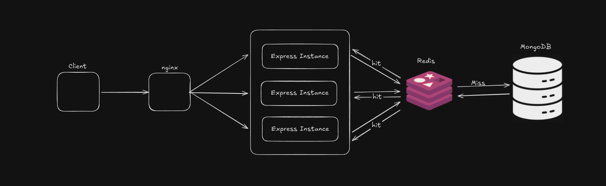

# Retail Sales Management System

## Overview
A comprehensive full-stack retail sales management system featuring advanced search, multi-select filtering, sorting, and pagination capabilities. Built with a clean, modular architecture for optimal performance and maintainability.

## System Architecture


## Tech Stack
**Backend:**
- Node.js & Express.js
- MongoDB with Mongoose ODM
- CSV Parser for data import

**Frontend:**
- React 18
- Vite (Build tool)
- Axios (HTTP client)
- Custom hooks for state management

## Search Implementation Summary
Case-insensitive full-text search across customer names and phone numbers using MongoDB regex queries. The search functionality integrates seamlessly with all filters and sorting options, providing real-time results as users type.

## Filter Implementation Summary
Multi-select filtering system with the following filters:
- **Customer Region**: Multi-select dropdown
- **Gender**: Multi-select dropdown
- **Age Range**: Min/Max numeric inputs
- **Product Category**: Multi-select dropdown
- **Tags**: Multi-select dropdown
- **Payment Method**: Multi-select dropdown
- **Date Range**: From/To date pickers

Filters work both independently and in combination, with MongoDB aggregation handling complex filter logic efficiently. All filter states persist across pagination and sorting operations.

## Sorting Implementation Summary
Flexible sorting mechanism supporting:
- **Date**: Newest First (default) / Oldest First
- **Quantity**: High to Low / Low to High
- **Customer Name**: A-Z / Z-A

Implemented using MongoDB's native sorting with indexed fields for optimal performance. Sorting maintains all active search and filter states.

## Pagination Implementation Summary
Server-side pagination with 10 items per page. Features include:
- Previous/Next navigation controls
- Page information display (e.g., "Showing 1 to 10 of 100 entries")
- Automatic page count calculation based on filtered results
- State preservation across page changes

Implemented using MongoDB's skip and limit operations for efficient data retrieval.

## Setup Instructions

### Prerequisites
- Node.js (v18 or higher)
- MongoDB (v6 or higher)
- npm or yarn

### Installation

1. Clone the repository:
```bash
git clone <repository-url>
cd truestate
```

2. Install root dependencies:
```bash
npm install
```

3. Install backend dependencies:
```bash
cd backend
npm install
cd ..
```

4. Install frontend dependencies:
```bash
cd frontend
npm install
cd ..
```

### Configuration

1. Configure backend environment:
```bash
cd backend
cp .env.example .env
```

Edit `.env` with your MongoDB connection string:
```
PORT=5000
MONGODB_URI=mongodb://localhost:27017/retail_sales
NODE_ENV=development
```

2. Seed the database:
```bash
# Place your sales_data.csv file in the backend directory
npm run seed /path/to/sales_data.csv
```

### Running the Application

**Option 1: Run both frontend and backend together (from root directory):**
```bash
npm run dev
```

**Option 2: Run separately:**

Backend:
```bash
cd backend
npm run dev
```

Frontend (in a new terminal):
```bash
cd frontend
npm run dev
```

### Access the Application
- Frontend: http://localhost:3000
- Backend API: http://localhost:5000
- Health Check: http://localhost:5000/health

## Project Structure
```
truestate/
├── backend/
│   ├── src/
│   │   ├── controllers/    # Request handlers
│   │   ├── services/       # Business logic
│   │   ├── models/         # Database schemas
│   │   ├── routes/         # API routes
│   │   ├── config/         # Configuration files
│   │   ├── utils/          # Helper functions
│   │   └── index.js        # Entry point
│   ├── package.json
│   └── README.md
├── frontend/
│   ├── src/
│   │   ├── components/     # React components
│   │   ├── hooks/          # Custom React hooks
│   │   ├── services/       # API services
│   │   ├── styles/         # CSS stylesheets
│   │   ├── App.jsx         # Main component
│   │   └── main.jsx        # Entry point
│   ├── package.json
│   └── README.md
├── docs/
│   └── architecture.md     # Architecture documentation
├── package.json
└── README.md
```

## API Endpoints

### GET /api/sales
Retrieve sales data with filters, search, sorting, and pagination.

**Query Parameters:**
- `search`: Search term for customer name/phone
- `customerRegion[]`: Array of regions
- `gender[]`: Array of genders
- `ageMin`, `ageMax`: Age range
- `productCategory[]`: Array of categories
- `tags[]`: Array of tags
- `paymentMethod[]`: Array of payment methods
- `dateFrom`, `dateTo`: Date range
- `sortBy`: Field to sort by (date/quantity/customerName)
- `sortOrder`: asc/desc
- `page`: Page number
- `limit`: Items per page

### GET /api/filter-options
Retrieve all available filter options.

### GET /api/statistics
Get aggregated statistics for current filters.

## Features
- Real-time search across customer data
- Multi-select filtering with 7+ filter types
- Flexible sorting options
- Server-side pagination
- Responsive design
- Statistics dashboard
- Error handling and loading states
- Optimized database queries with indexing

## Performance Optimizations
- MongoDB indexes on frequently queried fields
- Server-side pagination to reduce data transfer
- Efficient aggregation pipelines for statistics
- Component-level state management
- Debounced search inputs
- Lazy loading of filter options

## Browser Support
- Chrome (latest)
- Firefox (latest)
- Safari (latest)
- Edge (latest)
